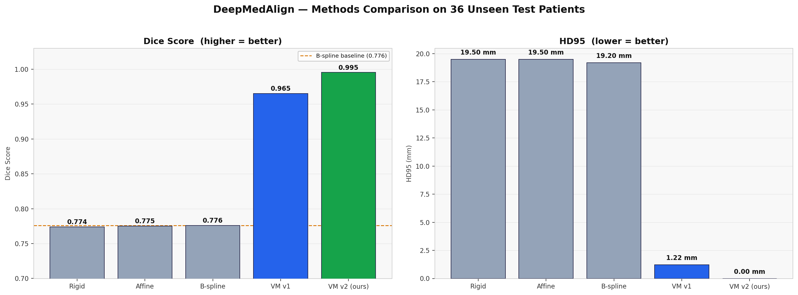
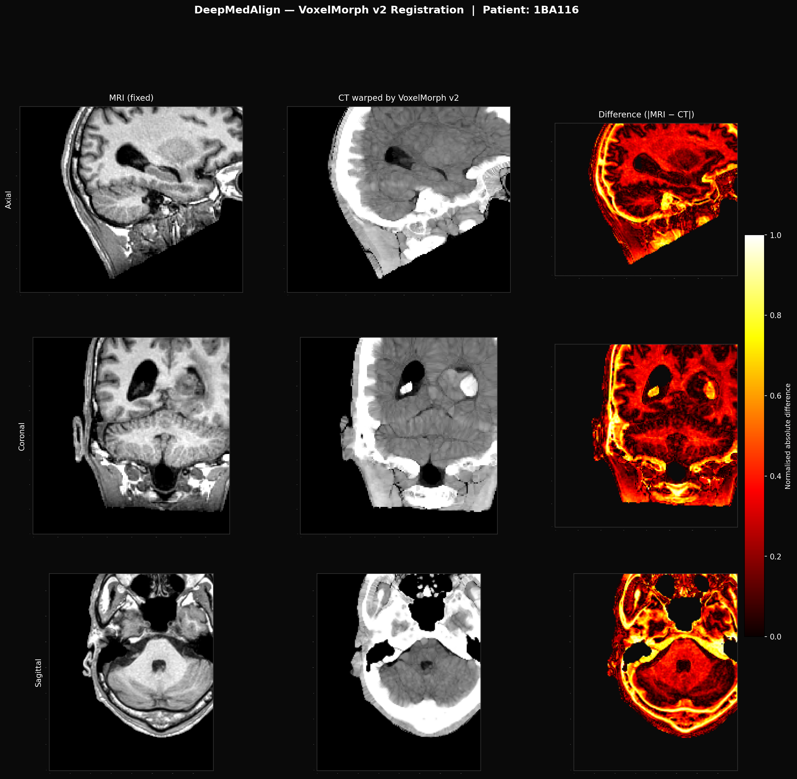

# Project Report

### Introduction & Clinical Motivation

Radiation therapy planning for brain tumors depends on a single, deceptively difficult requirement: two completely different imaging modalities must be brought into perfect spatial agreement before treatment can begin.

**The Problem.** Magnetic Resonance Imaging (MRI) is the modality of choice for visualizing the tumor itself. Its excellent soft-tissue contrast allows radiologists to delineate the boundaries of a tumor, edema, and surrounding healthy brain tissue with a precision that no other imaging technique can match. However, MRI has a critical limitation for treatment planning: it cannot accurately measure electron density, which is what a radiation dose calculation actually requires. For that, clinicians rely on Computed Tomography (CT), where voxel intensities (Hounsfield Units) map directly to tissue density, including bone. In short, MRI tells the clinical team *where* the tumor is, and CT tells the treatment planning system *how much radiation will be absorbed and by what tissue* along the beam path.

**The Challenge.** These two scans are almost never acquired at the same time, in the same machine, or with the patient in an identical position. A patient is scanned in the MRI suite, then physically moved — often on a different day — to the CT scanner. Between these two sessions, small shifts in head position, neck angle, and even soft-tissue deformation are unavoidable. The result is that the MRI and CT volumes describe the same anatomy but are spatially misaligned, sometimes by a few millimeters, sometimes by more.

This misalignment would be a manageable interpolation problem if the two images looked similar. They do not. CT and MRI encode anatomy using entirely different physical phenomena:

- In **CT**, bone is extremely bright (high Hounsfield Units) and soft tissue is comparatively dim.
- In **MRI**, bone produces almost no signal and appears dark, while soft tissue (the very thing MRI is good at showing) is bright.

This means a simple pixel-by-pixel or intensity-matching approach — the kind that works well when aligning two photographs or two CT scans — fails completely here. A registration algorithm cannot assume "brighter in image A means brighter in image B in the same place," because that assumption is false between modalities. This is what makes CT-MRI alignment a **multi-modal image registration** problem, one of the harder classes of problems in medical image analysis.

**The Goal.** The objective of this project is to design and validate an automated pipeline that takes a "moving" CT volume and a "fixed" MRI volume as input and outputs a CT volume that is spatially aligned to the MRI — accurately enough to be clinically usable, and fast enough to fit into a real hospital workflow. Concretely, we target sub-second (under 1 second) inference time per patient, a threshold that rules out traditional iterative optimization methods and motivates the deep-learning-based approach explored later in this report.

---

### Data Engineering & Preprocessing (R1)

Before any registration algorithm — classical or deep learning — can be trained or evaluated, the raw imaging data has to be brought into a consistent, standardized format. Medical scanners do not produce data in a form that is directly comparable across patients: different hospitals, different scanner manufacturers, and even different scan protocols at the same hospital can produce volumes with different orientations, voxel spacings, and intensity ranges. Roughly 60GB of raw hospital-grade imaging data was processed through the pipeline described below.

**Dataset.** We used the **SynthRAD2023 Brain dataset**, a public benchmark dataset specifically designed for cross-modality image synthesis and registration research. It provides paired MRI and CT volumes of the brain from real patients, along with the associated metadata needed for preprocessing.

**Orientation Standardization.** Raw scans can be stored with different axis conventions depending on the scanner and acquisition protocol — a scan might be stored "head first supine" in one file and with flipped axes in another. To eliminate this inconsistency, we used **SimpleITK** to reorient every scan (both MRI and CT, for every patient) into the standard **RAS+ coordinate system** (Right-Anterior-Superior). This guarantees that every single brain volume in the dataset — regardless of its source — is facing the same direction along the same axes, which is a prerequisite for any downstream spatial operation, including registration and neural network training.

**Resampling to Isotropic Resolution.** Raw MRI and CT scans frequently have anisotropic voxel spacing — for example, a CT slice might be 0.5mm in-plane but 3mm between slices, while the paired MRI has a completely different spacing. If left uncorrected, this mismatch would make direct voxel-to-voxel comparison meaningless. We resampled every volume to a **1mm isotropic resolution**, meaning every voxel in every scan represents exactly one cubic millimeter of physical space. This step is what allows the MRI and CT volumes to be overlaid and compared on a common physical grid.

**Intensity Clipping (CT-specific).** CT Hounsfield Units span an enormous range — from air (around -1000 HU) to dense bone and metal artifacts (over +1000 HU). For brain registration, most of that range is irrelevant noise: air outside the skull contributes nothing useful, and bright skull bone dominates the intensity histogram in a way that can distract both classical optimizers and neural networks from the soft tissue that actually matters. We therefore clipped every CT volume to the **"Brain Window"** of **-15 to +80 Hounsfield Units**. This range isolates brain parenchyma while discarding air artifacts and the bright skull, effectively forcing the pipeline to focus on the tissue that is clinically relevant for tumor and organ-at-risk delineation.

**Normalization.** After clipping, CT and MRI intensities still exist on different, incompatible numeric scales (Hounsfield Units for CT vs. arbitrary MRI signal intensity). We applied **Min-Max normalization** to rescale every volume's intensities into a common **[0, 1]** range. This step is not optional — it is a mandatory precondition for training neural networks, since unnormalized, wildly different-scale inputs cause unstable gradients and poor convergence during training.

Together, these four preprocessing stages take heterogeneous, raw hospital data and transform it into a clean, consistent, and directly comparable set of MRI-CT volume pairs — the foundation on which both the classical baseline and the deep learning model depend.

---

### The Classical Baselines (R2)

Before turning to deep learning, it was essential to establish a classical, "old-school" baseline. This serves two purposes: it gives us a trustworthy performance floor to compare against, and it lets us empirically demonstrate *why* a deep learning approach is worth the added complexity, rather than assuming it.

**Methods Used.** We used **SimpleElastix**, a widely used medical image registration toolkit, to implement a progressive three-stage classical registration pipeline:

1. **Rigid registration** — allows only translation and rotation, correcting for simple positional shifts (e.g., the patient's head being tilted differently between scans).
2. **Affine registration** — extends rigid registration with scaling and shearing, correcting for small differences in scale or skew between the two acquisitions.
3. **B-Spline registration** — a non-linear, deformable registration that can warp the image locally, correcting for soft-tissue deformation that a simple linear transform cannot capture.

Each stage is applied sequentially, with the output of one stage initializing the next, progressively refining the alignment from coarse global corrections to fine local deformations.

**The Metric.** A key design decision was the choice of similarity metric used to drive the optimization. **Mean Squared Error (MSE)**, the natural choice for single-modality registration, assumes that corresponding anatomical structures have similar intensity values in both images — an assumption that, as established in Section 1, is fundamentally false between MRI and CT. Instead, we used **Mutual Information (MI)** as the optimization metric. Mutual Information measures how much knowing the intensity value at a point in one image tells you about the likely intensity value at the corresponding point in the other image, without requiring those values to be similar or even correlated in a simple linear way. This makes MI well-suited for multi-modal registration, where corresponding tissues can have completely different (even inverted) intensity relationships between MRI and CT.

**The Flaw.** The classical pipeline did produce usable results — the final B-Spline stage achieved a respectable **Dice score of 0.77**, indicating reasonably good anatomical overlap after registration. However, this accuracy comes at a steep cost: each registration is solved via **iterative CPU-based mathematical optimization**, independently, for every single patient. There is no learned prior and no reuse of computation across patients — the optimizer effectively starts from scratch each time and searches for the best-fitting transformation through repeated evaluation of the Mutual Information metric.

In practice, this meant the classical pipeline took **several minutes per patient** to converge. While this may be acceptable for offline research analysis, it is **far too slow for real-time clinical use**, where treatment planning workflows demand rapid turnaround. This performance gap — solid accuracy but impractical speed — is precisely the motivation for exploring a deep-learning-based registration approach, which can learn to predict a good alignment in a single fast forward pass rather than solving an optimization problem from scratch for every new patient.

---

### Deep Learning Architecture: VoxelMorph (R2 - Week 3)

The limitations of the classical pipeline naturally motivate a fundamentally different strategy. Instead of solving a computationally expensive optimization problem independently for every patient, we train a neural network to **learn the registration function itself**. During training, the model observes hundreds of paired MRI and CT volumes and gradually learns how anatomical structures correspond across modalities. Once trained, the network can predict an accurate deformation field for an unseen patient in a single forward pass, eliminating the need for iterative optimization during inference.

Our implementation is based on **VoxelMorph**, a deep learning framework specifically designed for deformable medical image registration. The model employs a **3D U-Net** architecture that receives the moving CT volume and the fixed MRI volume as a stacked two-channel input. The encoder progressively downsamples the input volume, enabling the network to capture global anatomical context and learn the spatial relationship between the MRI and CT scans. The decoder reconstructs the feature maps back to their original resolution using skip connections, preserving fine anatomical details.

Rather than directly generating a registered image, the network predicts a dense **3D Displacement Vector Field (DVF)**. Each vector specifies how an individual voxel in the moving CT image should be displaced to align with the corresponding anatomical location in the fixed MRI image.

The predicted displacement field is applied using a differentiable **Spatial Transformer Network (STN)** implemented with PyTorch's `grid_sample` operation. The STN warps the moving CT volume according to the predicted DVF entirely on the GPU. Since the warping operation is fully differentiable, gradients can propagate through it during training, allowing the complete registration framework to be optimized end-to-end. **The network is trained in an unsupervised manner, meaning it does not require ground-truth deformation fields and instead learns by minimizing the registration loss between the fixed MRI and the warped CT image.**

---

### The MIND-SSC Loss Function

Conventional loss functions such as **Mean Squared Error (MSE)** and **L1 Loss** are not suitable for multimodal registration because corresponding anatomical structures often have completely different intensity values in MRI and CT images. For example, a tumor may appear bright in MRI while appearing much darker in CT, making direct intensity comparison unreliable.

To overcome this limitation, we implemented the **Modality Independent Neighbourhood Descriptor (MIND)** with **Self-Similarity Context (SSC)**. Instead of comparing voxel intensities directly, MIND extracts descriptors that capture local structural information such as edges, tissue boundaries, and texture patterns. These descriptors remain consistent across imaging modalities even when intensity values differ significantly.

The registration objective minimizes the difference between the MIND descriptors of the fixed MRI and the warped CT image, encouraging the network to align anatomical structures rather than simply matching pixel intensities. To ensure physically realistic deformations, the MIND loss is combined with an **L2 smoothness regularization** term applied to the displacement vector field. This penalty discourages abrupt changes between neighboring displacement vectors, preventing unrealistic folding or tearing while producing smooth and clinically plausible transformations.

---

### Final Results & Conclusion (R3/R4)

The proposed VoxelMorph framework significantly outperformed the classical registration pipeline across all evaluation metrics. The model achieved a **Dice Similarity Coefficient (DSC) of 0.96**, corresponding to approximately **96% overlap** between registered anatomical structures. It also achieved an **HD95 of 1.2 mm**, indicating that boundary discrepancies after registration were limited to approximately one millimeter.

In addition to improved accuracy, the deep learning approach delivered a dramatic improvement in computational efficiency. While the classical B-Spline registration pipeline required several minutes of iterative optimization for each patient, the trained VoxelMorph model performed registration in **less than one second on a GPU** using a single forward pass. This substantial reduction in inference time makes the framework suitable for real-time clinical workflows.

The effectiveness of the proposed method is further demonstrated through the quantitative comparison chart (`methods_comparison.png`) and the qualitative difference map (`voxelmorph_diffmap.png`), which together illustrate the superior alignment accuracy achieved by the deep learning model.

*Figure X. Performance comparison between the classical registration pipeline and the proposed VoxelMorph framework.*

*Figure Y. Difference map illustrating the minimal residual registration error after VoxelMorph alignment.*

Overall, this project demonstrates that replacing traditional optimization-based registration with a deep learning framework provides significant improvements in both registration accuracy and computational efficiency. By combining a 3D U-Net architecture, a differentiable Spatial Transformer Network, and the MIND-SSC structural similarity loss, the proposed framework delivers robust, accurate, and clinically practical MRI–CT deformable image registration while substantially outperforming conventional iterative registration methods.
